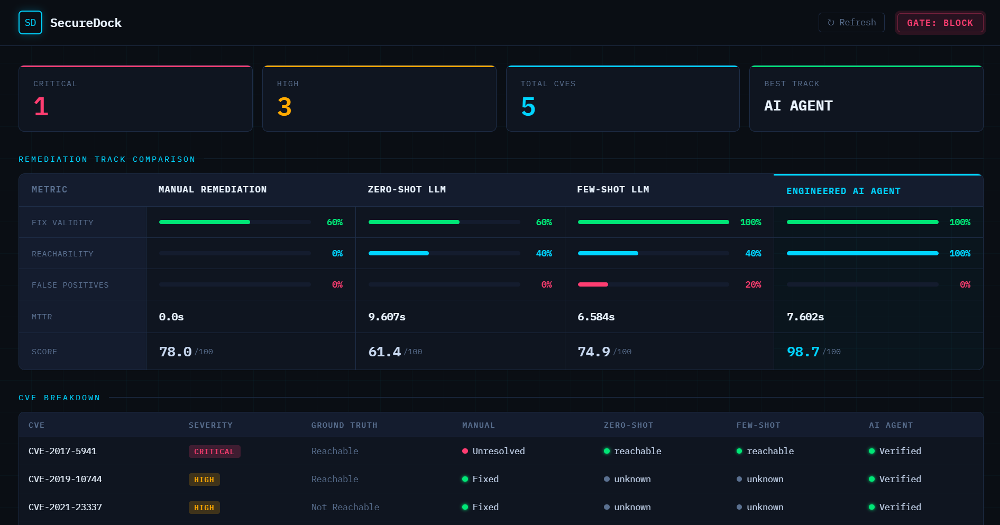

# SecureDock

DevSecOps pipeline that scans container images for vulnerabilities and benchmarks zero-shot, few-shot, and agentic AI remediation approaches against a manual baseline.



## Stack

Snyk, Anthropic API, Docker Compose, GitHub Actions, Flask

## What it does

On every code push, SecureDock builds the target container image, scans it with Snyk, and runs four remediation tracks in parallel:

1. Builds the container image and scans it with Snyk
2. Generates a CycloneDX SBOM and diffs it against the last clean baseline
3. Runs four remediation tracks in parallel: manual, zero-shot LLM, few-shot LLM, and an engineered AI agent
4. Evaluates all tracks against labeled ground truth
5. Enforces a policy gate that blocks deployment on critical CVEs or SBOM regressions
6. Surfaces results in a dashboard at `http://localhost:5050`

## Services

| Service | Description |
|---|---|
| `target-app` | Deliberately vulnerable Node.js app |
| `scanner` | Snyk CLI scan + CycloneDX SBOM |
| `sbom-differ` | Diffs SBOMs against baseline, flags regressions |
| `manual-agent` | Applies Snyk suggestions verbatim |
| `zero-shot-llm` | Claude with a minimal prompt |
| `few-shot-llm` | Claude with hand-crafted triage examples |
| `ai-agent` | Claude with structured prompt, SBOM context, policy enforcement, re-scan loop |
| `evaluator` | Scores all tracks against labeled ground truth |
| `gate` | Enforces policy.yaml, blocks on violations |
| `dashboard` | Flask UI at port 5050 |

## Quick Start

```bash
git clone https://github.com/leo-876/SecureDock.git
cd SecureDock

cp .env.example .env
# Add your ANTHROPIC_API_KEY

chmod +x scripts/run.sh
./scripts/run.sh
```

Dashboard: `http://localhost:5050`

## Environment Variables

```
ANTHROPIC_API_KEY=   # required
SNYK_TOKEN=          # optional, falls back to demo mode
DEMO_MODE=true       # set to false if SNYK_TOKEN is provided
PIPELINE_EVENT=push  # push | pr | merge
GITHUB_TOKEN=        # optional, enables fix PR creation
GITHUB_REPO=         # optional, e.g. username/SecureDock
```